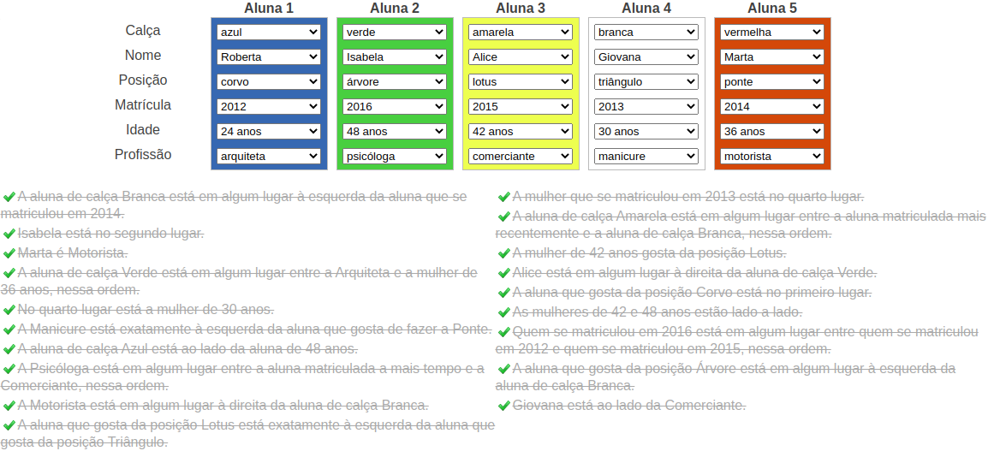

# yoga-class-problem

---
## Objetivo

- Cinco mulheres estão participando de uma aula de yoga. Descubra qual é a posição favorita de yoga de cada uma delas.
- A solução deve ser encontrada utilizando prolog.

---
## Execução

- `swipl`
- `[yogaClass].`
- `solucao().`

---
## Dicas

- A aluna de calça Branca está em algum lugar à esquerda da aluna que se matriculou em 2014.
- Isabela está no segundo lugar.
- Marta é Motorista.
- A aluna de calça Verde está em algum lugar entre a Arquiteta e a mulher de 36 anos, nessa ordem.
- No quarto lugar está a mulher de 30 anos.
- A Manicure está exatamente à esquerda da aluna que gosta de fazer a Ponte.
- A aluna de calça Azul está ao lado da aluna de 48 anos.
- A Psicóloga está em algum lugar entre a aluna matriculada a mais tempo e a Comerciante, nessa ordem.
- A Motorista está em algum lugar à direita da aluna de calça Branca.
- A aluna que gosta da posição Lotus está exatamente à esquerda da aluna que gosta da posição Triângulo.
- A mulher que se matriculou em 2013 está no quarto lugar.
- A aluna de calça Amarela está em algum lugar entre a aluna matriculada mais recentemente e a aluna de calça Branca, nessa ordem.
- A mulher de 42 anos gosta da posição Lotus.
- Alice está em algum lugar à direita da aluna de calça Verde.
- A aluna que gosta da posição Corvo está no primeiro lugar.
- As mulheres de 42 e 48 anos estão lado a lado.
- Quem se matriculou em 2016 está em algum lugar entre quem se matriculou em 2012 e quem se matriculou em 2015, nessa ordem.
- A aluna que gosta da posição Árvore está em algum lugar à esquerda da aluna de calça Branca.
- Giovana está ao lado da Comerciante.
---
## Resultado Esperado

---